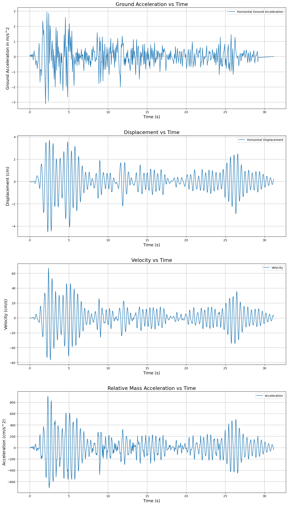

# Central Difference Method for SDOF System Analysis

   

> This Jupyter Notebook provides a Python implementation of the **Central Difference Method** to determine the dynamic response of a Single-Degree-of-Freedom (SDOF) system subjected to the classic **1940 El Centro earthquake** ground motion.

---

## 📊 Results



---

## 📚 Table of Contents
* [Key Concepts](#-key-concepts)
* [Methodology](#-methodology)
* [How to Use](#-how-to-use)
* [Customization](#-customization)

---

## 🔬 Key Concepts

The core of this analysis is the Central Difference Method, a powerful and straightforward numerical technique for solving the equation of motion for a dynamic system. This method approximates the velocity and acceleration at a given time step using the displacements at adjacent time steps.

The fundamental equation of motion being solved is:

$$m\ddot{u}(t) + c\dot{u}(t) + ku(t) = P(t) = -m\ddot{u}_g(t)$$

Where:
- $m$ = Mass of the system
- $c$ = Damping coefficient
- $k$ = Stiffness of the system
- $\ddot{u}(t), \dot{u}(t), u(t)$ = Acceleration, velocity, and displacement of the mass relative to the ground
- $P(t)$ = Effective load due to ground acceleration, $\ddot{u}_g(t)$

---
## ⚙️ Methodology

The notebook is structured to follow the logical steps of a dynamic analysis:

1.  **Parameter Initialization**: Key structural properties (**Stiffness `k`**, **Mass `m`**, and **Damping Ratio `dr`**) are defined. Derived properties like natural frequency ($\omega_n$), natural period ($T_n$), and the damping coefficient ($c$) are then calculated.

2.  **Data Loading**: The El Centro ground acceleration data is loaded from the `Data_Elcentro.csv` file.

3.  **Initial Calculations**: The algorithm is kick-started by setting initial conditions ($u_0, v_0$) and calculating the displacement at a fictitious previous time step ($u_{-1}$).

4.  **Iterative Solution**: A `for` loop iterates through each time step of the earthquake record, calculating the displacement for the next time step ($u_{i+1}$).

5.  **Visualization**: The final results are processed and visualized using `matplotlib` to show the system's response over time (Displacement, Velocity, and Acceleration).

---
## 🚀 How to Use

To run this analysis, follow these steps:

1.  **Prerequisites**: Ensure you have Python and the required libraries installed.
    ```bash
    pip install numpy pandas matplotlib
    ```

2.  **Input File**: Place the `Data_Elcentro.csv` file in the same directory as the Jupyter Notebook.

3.  **Execution**: Open the `Central Difference Method.ipynb` file in a Jupyter environment and run the cells in order from top to bottom.

---
## 🔧 Customization

You can easily adapt this notebook to analyze different SDOF systems:

-   **Structural Properties**: Modify the `k`, `m`, and `dr` variables in the **Initial Parameters** section to match your structure.
-   **Earthquake Data**: Replace `Data_Elcentro.csv` with another ground motion file. Ensure it is a CSV with "time" and "acceleration" columns.
